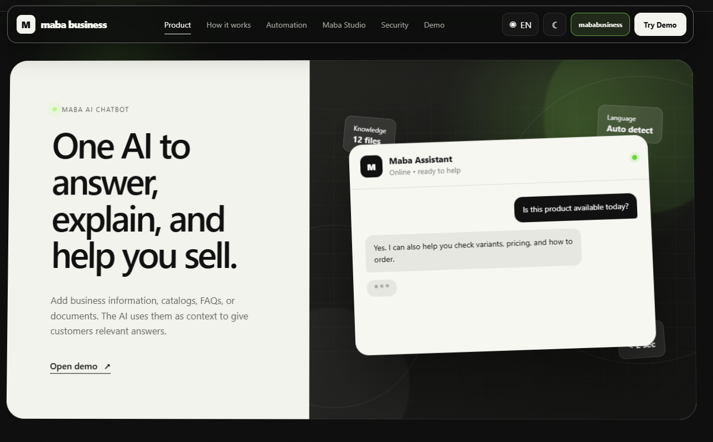
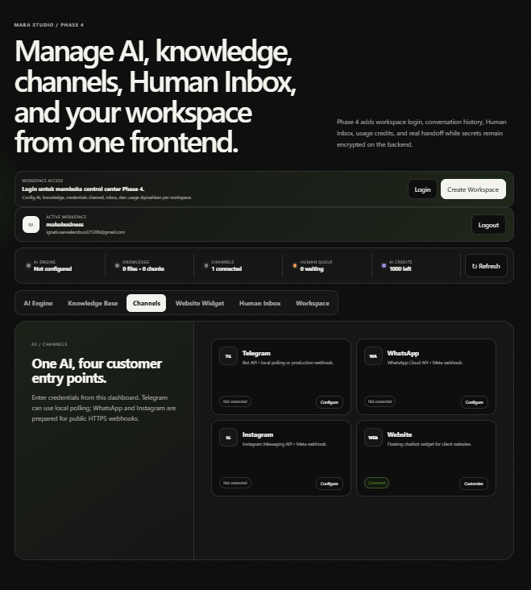
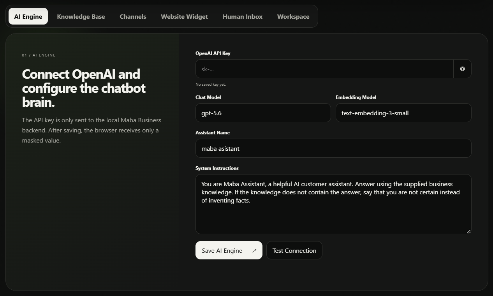
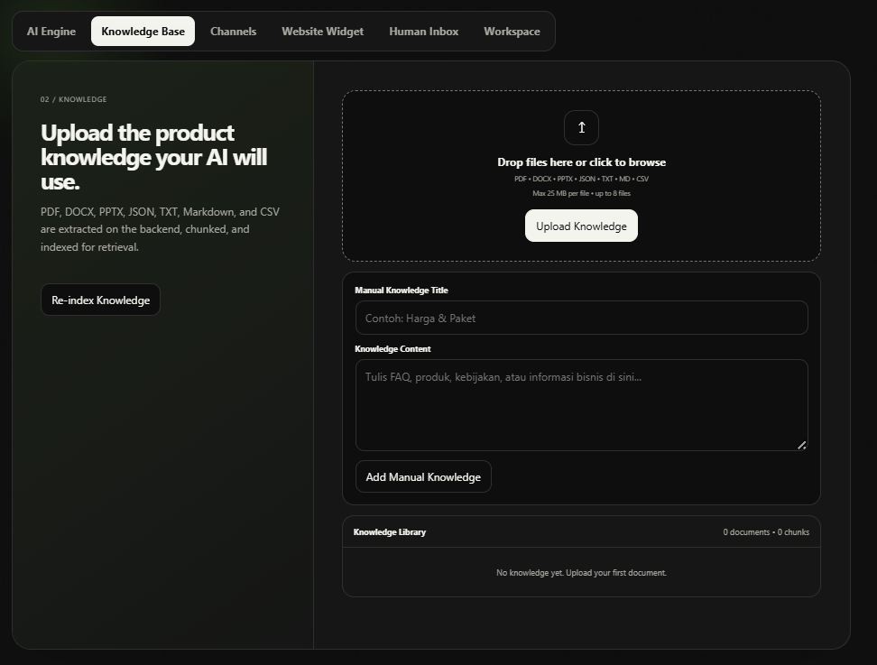
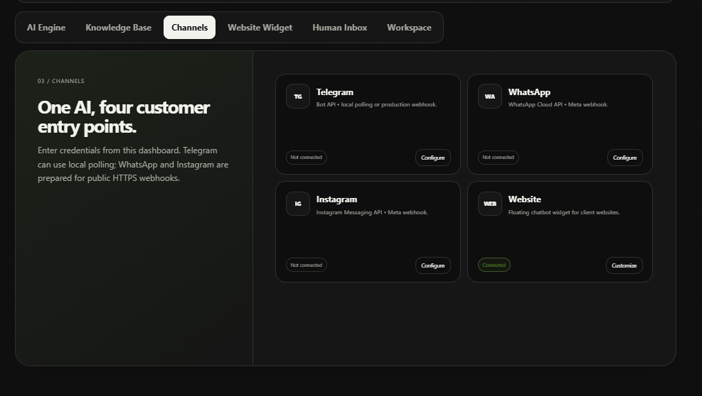
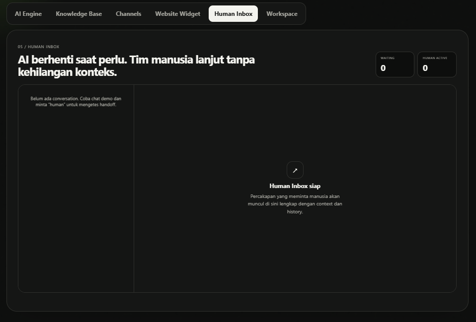
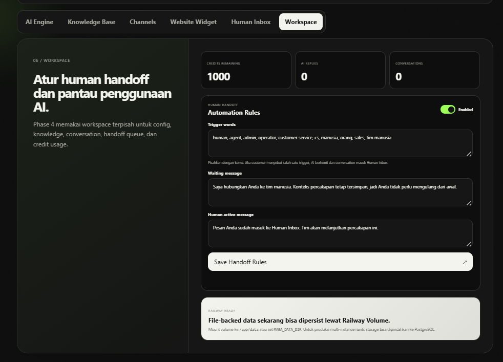
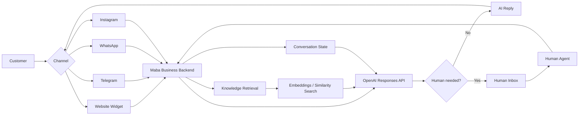

# Maba Business — AI Customer Experience Platform

**Maba Business** is a full-stack AI customer experience prototype that lets a business configure one AI assistant, connect its knowledge, serve customers across multiple channels, and hand conversations to a human when needed.

> **Project status:** Phase 4 portfolio prototype. Designed for local use and single-instance Railway deployment while the persistence layer is still file-backed.



## Why I Built It

A useful business AI system needs more than a prompt and a chat box. It needs trusted business knowledge, conversation state, channel connections, authentication, safe secret handling, and a clear path from AI to a human agent.

Maba Business brings those pieces into one workspace.

## Core Features

- **AI Engine** — configure the OpenAI chat model, embedding model, assistant name, and system instructions from the frontend.
- **RAG Knowledge Base** — upload PDF, DOCX, PPTX, JSON, TXT, Markdown, and CSV files; content is extracted, chunked, embedded, and retrieved as AI context.
- **Multi-channel architecture** — website widget, Telegram, WhatsApp Cloud API, and Instagram Messaging integration paths.
- **Human Handoff** — trigger AI-to-human escalation while preserving conversation context.
- **Human Inbox** — view waiting conversations, take over, reply as a human agent, and return control to the AI.
- **Workspace Authentication** — workspace creation, login, server-side sessions, and isolated business data.
- **Encrypted Secrets** — API keys and channel tokens are stored on the backend using AES-256-GCM rather than browser localStorage.
- **Usage Credits** — prototype-level counters for AI replies, conversations, and handoff activity.
- **Embeddable Website Chatbot** — generate a workspace-aware script for a client website.
- **Railway-ready backend** — health check, start command, and persistent-volume configuration are included.

## Product Screens

### Maba Studio

Manage AI configuration, knowledge, channels, Human Inbox, handoff settings, and usage from one frontend.



### AI Engine

Configure the OpenAI connection and chatbot behavior without editing backend code.



### Knowledge Base

Upload business documents or add manual knowledge. Supported document formats are processed into retrieval context for the assistant.



### Channels

One workspace can prepare customer entry points for Website, Telegram, WhatsApp, and Instagram.



### Human Inbox

Conversations that need a person can be moved into a dedicated human queue while retaining their history and context.



### Handoff & Workspace Controls

Configure handoff trigger words, customer-facing waiting messages, and workspace-level usage information.



## System Architecture



## Knowledge Retrieval Flow

```text
Business files / manual knowledge
            ↓
       Text extraction
            ↓
          Chunking
            ↓
         Embeddings
            ↓
     Similarity retrieval
            ↓
      Relevant context
            ↓
       OpenAI response
```

## Human Handoff Flow

```text
Customer message
      ↓
AI handles conversation
      ↓
Handoff trigger detected
      ↓
Conversation + context preserved
      ↓
Human Inbox: waiting
      ↓
Agent takes over
      ↓
Human reply sent to the original channel
      ↓
Return to AI when appropriate
```

## Tech Stack

| Layer | Technology |
| --- | --- |
| Frontend | HTML, CSS, JavaScript |
| Backend | Node.js 22+, Express 5 |
| AI | OpenAI Responses API |
| Embeddings | OpenAI `text-embedding-3-small` by default |
| Document processing | `pdf-parse`, `mammoth`, `jszip` |
| Uploads | Multer |
| Authentication | Node.js `scrypt`, random server sessions, HTTP-only cookies |
| Secret storage | AES-256-GCM encryption |
| Messaging | Telegram Bot API, WhatsApp Cloud API, Instagram Messaging API |
| Deployment | Railway / Railpack |

## Project Structure

```text
maba-business-ai-platform/
├── backend/
│   ├── server.js
│   ├── storage.js
│   ├── auth.js
│   ├── conversations.js
│   ├── ai.js
│   ├── knowledge.js
│   └── channels.js
├── frontend/
│   ├── index.html
│   ├── styles.css
│   ├── app.js
│   └── widget.html
├── docs/
│   └── screenshots/
├── data/
│   └── uploads/
│       └── .gitkeep
├── .env.example
├── .gitignore
├── package.json
├── railway.toml
├── run-local.bat
└── run-local.sh
```

## Run Locally

### Requirements

- Node.js **22+**
- npm

### 1. Clone the repository

```bash
git clone https://github.com/YOUR_USERNAME/maba-business-ai-platform.git
cd maba-business-ai-platform
```

### 2. Install dependencies

```bash
npm install
```

### 3. Create your environment file

Copy `.env.example` to `.env` and replace the placeholder master key with a strong random value.

```env
PORT=5500
NODE_ENV=development
MABA_MASTER_KEY=replace-with-a-long-random-secret
MABA_DATA_DIR=./data
```

> Never commit your real `.env`, OpenAI API key, Telegram bot token, Meta access token, or other credentials.

### 4. Start the project

```bash
npm start
```

Then open:

```text
http://localhost:5500
```

On Windows you can also run `run-local.bat`. On macOS/Linux use `run-local.sh`.

## First-time Setup

1. Open **Maba Studio**.
2. Select **Create Workspace**.
3. Create your workspace account.
4. Open **AI Engine** and add an OpenAI API key.
5. Test the AI connection.
6. Add or upload business knowledge.
7. Configure the channels you want to use.
8. Configure Human Handoff rules in **Workspace**.
9. Test the assistant from the website demo/widget.

## Supported Knowledge Formats

- PDF
- DOCX
- PPTX
- JSON
- TXT
- Markdown
- CSV

Scanned image-only PDFs currently require an OCR layer that is not included in Phase 4.

## Website Widget

The generated widget script is workspace-aware:

```html
<script
  src="https://YOUR-DOMAIN/widget.js"
  data-maba-business
  data-workspace="YOUR_WORKSPACE_ID">
</script>
```

## Channel Notes

### Telegram

Supports local polling and production webhook configuration.

### WhatsApp Cloud API

Workspace configuration includes Meta access token, Phone Number ID, WABA ID, Graph API version, verify token, and a public base URL.

Webhook pattern:

```text
/webhooks/whatsapp/{workspaceId}
```

### Instagram Messaging

Workspace configuration includes Meta access token, Instagram Account ID, Graph API version, verify token, and a public base URL.

Webhook pattern:

```text
/webhooks/instagram/{workspaceId}
```

## Security Design

Phase 4 includes:

- password hashing with Node.js `scrypt`
- random server-side sessions
- HTTP-only session cookies
- workspace isolation
- encrypted OpenAI keys and channel credentials using AES-256-GCM
- masked secrets returned to the frontend
- `.env` and runtime data excluded from Git

This is still a prototype. A production SaaS deployment should additionally consider CSRF protection, rate limiting, email verification, password reset, audit logging, granular team roles, and production-grade secret management.

## Railway Deployment

`railway.toml` already includes:

- Railpack builder
- `npm start`
- `/api/health` health check
- restart-on-failure policy

Recommended production environment variables:

```env
NODE_ENV=production
MABA_MASTER_KEY=YOUR_LONG_RANDOM_SECRET
MABA_DATA_DIR=/app/data
```

Because Phase 4 uses file-backed persistence, attach a Railway Volume mounted at:

```text
/app/data
```

Without persistent storage, runtime data can be lost when the container is replaced.

## Prototype Limitations / Next Architecture Step

The current project is suitable for a local or **single-instance prototype**. Before scaling to a multi-replica SaaS architecture, the next major step would be migrating persistent application state to managed infrastructure, for example:

- PostgreSQL for users, sessions, conversations, handoffs, usage, and workspace metadata
- object storage for uploaded knowledge files
- a production vector database or vector-enabled relational database
- background queues for document ingestion and long-running tasks
- production billing and token-based usage metering

## Static Check

```bash
npm run check
```

This validates the syntax of the main backend and frontend JavaScript files.

## Repository Purpose

This repository is published as a **portfolio engineering project** demonstrating full-stack AI product development, RAG-style knowledge retrieval, multi-channel messaging architecture, authentication, security-conscious secret handling, and AI-to-human workflow design.
